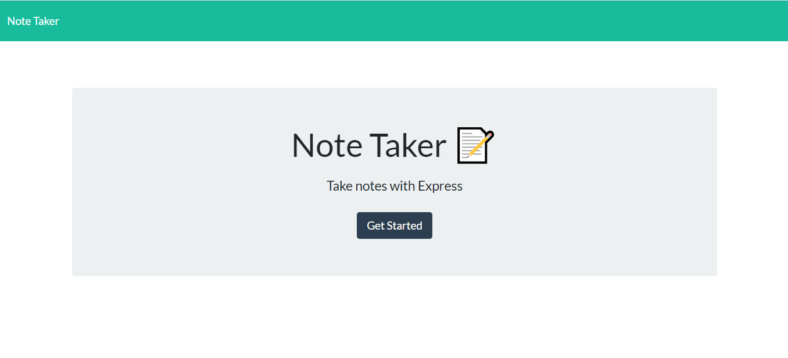
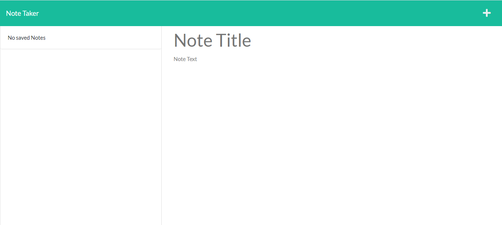
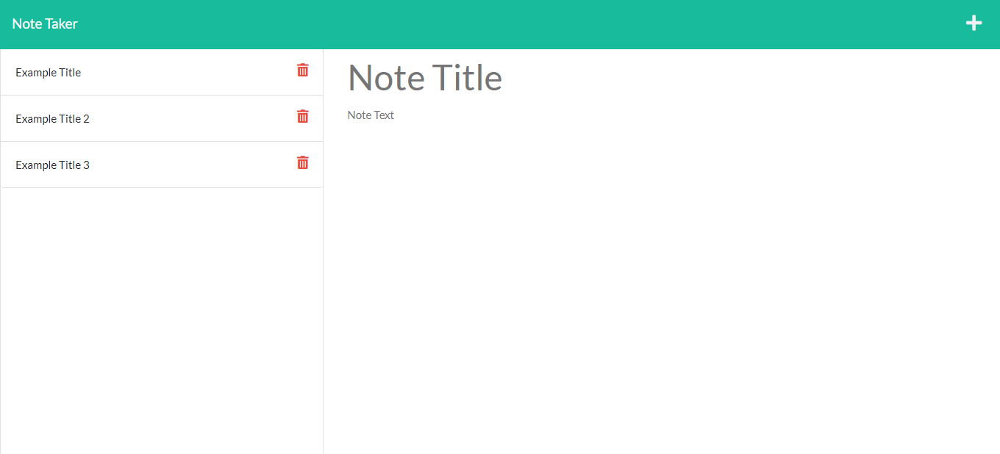

# Unit-Eleven-Homework

## Description
Note Taker application back end created from starter code of front end. Used to write and save notes. Deployed to Heroku.

## Table of Contents 
 - [Installation](#installation)
 - [Usage](#usage)
 - [Credits](#credits)
 - [Contribution Guidelines](#contribution-guidelines)
 - [Test Instructions](#test-instructions)
 - [License](#license)

## Installation
Use package.json to download dependencies (using npm install).

## Usage
On opening the Note Taker application, there is link to the notes page on the landing page. Clicking it brings you to note page with existing notes in the left-hand column and empty fields in the right-hand column to enter new notes. Can enter title and text for each new note, then a Save icon appears (navigation at top page) and on clicking it, the new note is saved and shows up in left-hand column. If you click on this note in the left, it will then appear again in the right column. There is a Write icon in navigation at page top and on clicking this, you can enter a new note title and test in an empty field on the right column.

## Credits
Libraries:
* fs to access file system
* express for creating the back end
* path for accessing files
* uuid for creating unique id

## Contribution Guidelines
Utilize The Contributor Covenant (https://www.contributor-covenant.org/version/2/0/code_of_conduct/code_of_conduct.md) as reference for appropriate contribution guidelines.

## Test Instructions
n/a

## License
License type: MIT

    "Copyright 2021 <COPYRIGHT HOLDER>

    Permission is hereby granted, free of charge, to any person obtaining a copy of this software and associated documentation files (the "Software"), to deal in the Software without restriction, including without limitation the rights to use, copy, modify, merge, publish, distribute, sublicense, and/or sell copies of the Software, and to permit persons to whom the Software is furnished to do so, subject to the following conditions:
    
    The above copyright notice and this permission notice shall be included in all copies or substantial portions of the Software.
    
    THE SOFTWARE IS PROVIDED "AS IS", WITHOUT WARRANTY OF ANY KIND, EXPRESS OR IMPLIED, INCLUDING BUT NOT LIMITED TO THE WARRANTIES OF MERCHANTABILITY, FITNESS FOR A PARTICULAR PURPOSE AND NONINFRINGEMENT. IN NO EVENT SHALL THE AUTHORS OR COPYRIGHT HOLDERS BE LIABLE FOR ANY CLAIM, DAMAGES OR OTHER LIABILITY, WHETHER IN AN ACTION OF CONTRACT, TORT OR OTHERWISE, ARISING FROM, OUT OF OR IN CONNECTION WITH THE SOFTWARE OR THE USE OR OTHER DEALINGS IN THE SOFTWARE."

Source for licensing information: <a href="https://opensource.org/licenses/MIT">Link to MIT license information</a>

## Screenshots

Screenshot of Note Taker application on load:

Screenshot of the notes page of Note Taker application:

Screenshot of notes page of Note Taker application with saved notes:

## URLs
<a href="https://github.com/mlward639/Unit-Eleven-Homework">Link to GitHub Repository</a>

<a href="#">Link to Deployed Heroku Application</a>
